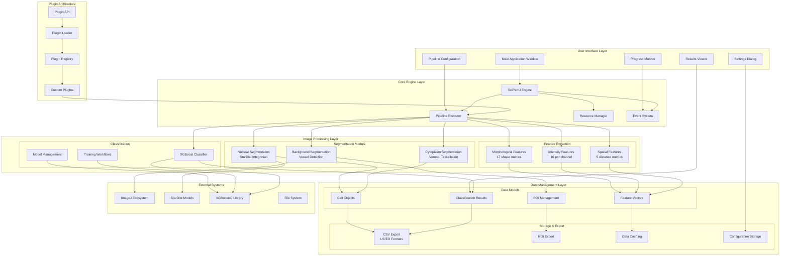
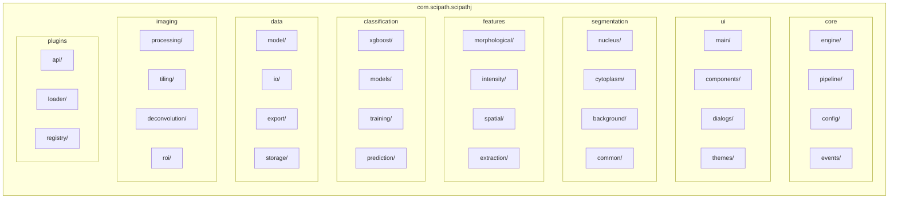
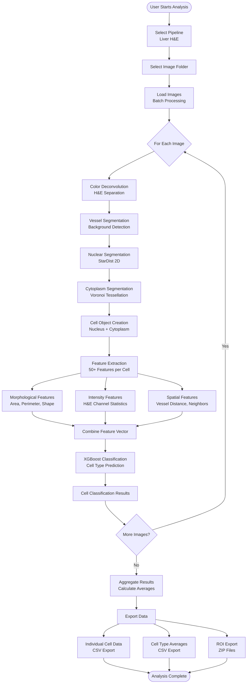
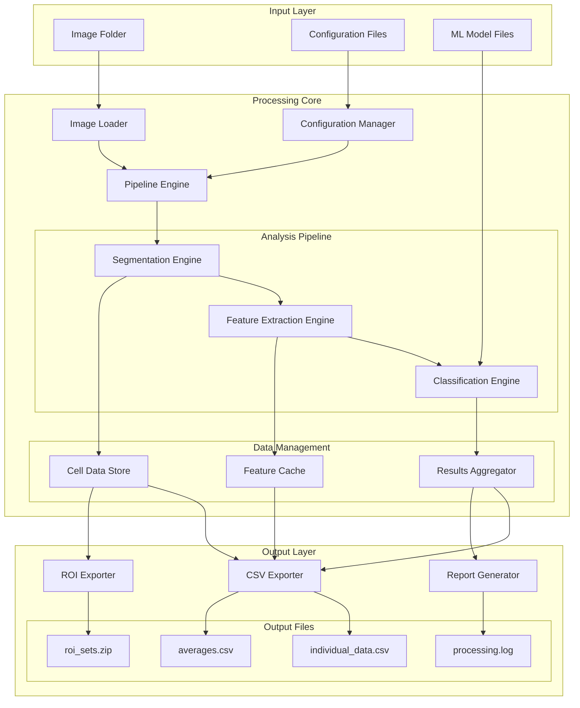
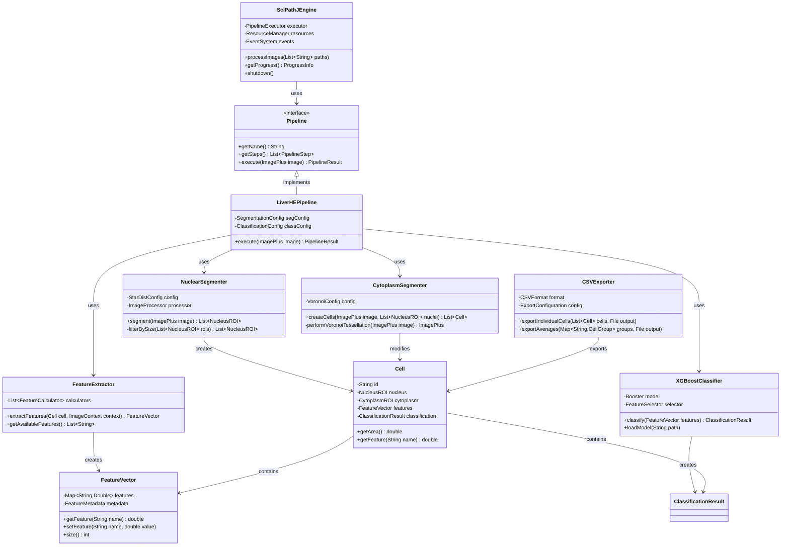
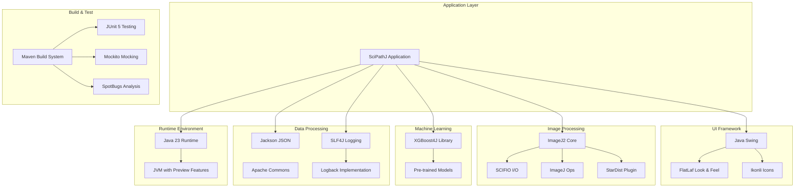
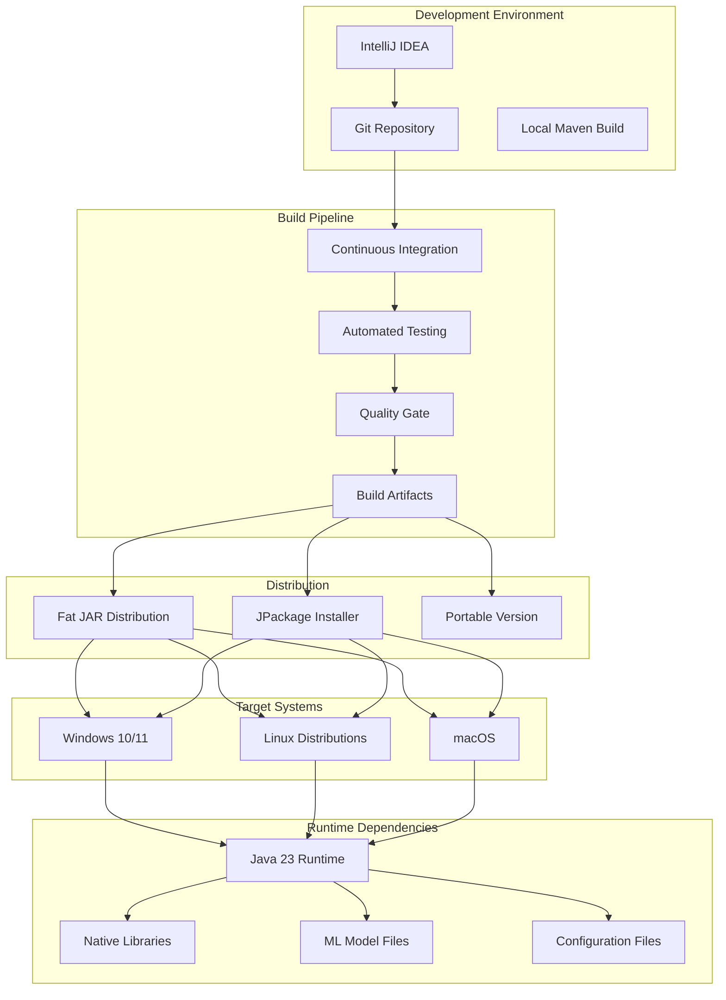

# SciPathJ Complete Architecture Diagram

## System Overview

## Detailed Package Structure

## Processing Pipeline Flow

## Data Flow Architecture

## Class Relationship Diagram

## Technology Stack Integration

## Deployment Architecture

This comprehensive architecture diagram shows:

1. **System Overview**: High-level component relationships
2. **Package Structure**: Detailed code organization
3. **Processing Pipeline**: Step-by-step workflow
4. **Data Flow**: How information moves through the system
5. **Class Relationships**: Object-oriented design structure
6. **Technology Integration**: External dependencies and frameworks
7. **Deployment Architecture**: Build and distribution strategy

The diagrams provide a complete visual representation of the SciPathJ architecture, from user interface down to the underlying technology stack and deployment strategy.