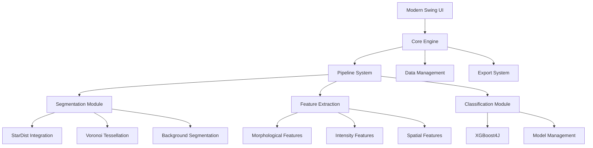

# SciPathJ Implementation Plan
**Segmentation and Classification of Images, Pipelines for the Analysis of Tissue Histopathology**

## Executive Summary

SciPathJ is a modern Java-based image analysis software for tissue histopathology, building upon the proven SCHELI implementation while adding extensibility, modern UI, and enhanced performance. This document outlines the complete architecture and implementation roadmap.

## 1. Project Overview

### 1.1 Vision
Create a highly automated, extensible software for histopathological image analysis that processes folder-based image batches and outputs comprehensive spreadsheet results with optional raw data export.

### 1.2 Core Workflow
1. User opens software and selects pipeline (e.g., Liver H&E)
2. User inputs folder with images
3. System segments vessels, background, and parenchyma using ML
4. System segments parenchyma into nuclei and cytoplasm
5. Cell objects are created by assigning cytoplasm to nuclei
6. Features are measured and calculated for each cell
7. XGBoost classifies cells based on features
8. Averages are calculated per cell class and exported

### 1.3 Key Requirements Analysis (from SCHELI)
- **Proven ML Stack**: StarDist for nuclei, Voronoi tessellation for cytoplasm, XGBoost4J for classification
- **Robust Configuration**: Comprehensive settings management with persistence
- **Advanced Feature Extraction**: 50+ morphological and intensity features per cell
- **Flexible Export**: US/EU CSV formats with semicolon/comma support
- **Spatial Analysis**: Neighbor counting, vessel distance calculations
- **Memory Efficiency**: Handles 2000x3000px images, scalable to whole-slide images

## 2. Architecture Design

### 2.1 Core Architecture Principles



### 2.2 Package Structure

```
com.scipath.scipathj/
├── core/
│   ├── engine/           # Core processing engine
│   ├── pipeline/         # Pipeline management
│   ├── config/          # Configuration system
│   └── events/          # Event system for UI updates
├── ui/
│   ├── main/            # Main application window
│   ├── components/      # Reusable UI components
│   ├── dialogs/         # Settings and progress dialogs
│   └── themes/          # Theme management
├── segmentation/
│   ├── nucleus/         # Nuclear segmentation (StarDist)
│   ├── cytoplasm/       # Cytoplasm segmentation (Voronoi)
│   ├── background/      # Background/vessel segmentation
│   └── common/          # Shared segmentation utilities
├── features/
│   ├── morphological/   # Shape and size features
│   ├── intensity/       # Color and staining features
│   ├── spatial/         # Neighbor and distance features
│   └── extraction/      # Feature extraction engine
├── classification/
│   ├── xgboost/         # XGBoost integration
│   ├── models/          # Model management
│   ├── training/        # Training workflows
│   └── prediction/      # Classification workflows
├── data/
│   ├── model/           # Data models (Cell, Feature, etc.)
│   ├── io/              # File I/O operations
│   ├── export/          # Export system
│   └── storage/         # Data storage and caching
├── imaging/
│   ├── processing/      # Image processing utilities
│   ├── tiling/          # Large image tiling support
│   ├── deconvolution/   # Color deconvolution
│   └── roi/             # ROI management
└── plugins/
    ├── api/             # Plugin API interfaces
    ├── loader/          # Plugin loading system
    └── registry/        # Plugin registry
```

## 3. Detailed Component Design

### 3.1 Core Engine

**Purpose**: Central orchestrator for all processing operations

**Key Classes**:
- `SciPathJEngine`: Main processing coordinator
- `PipelineExecutor`: Executes pipeline steps
- `ProgressManager`: Handles progress reporting
- `ResourceManager`: Manages memory and resources

**Responsibilities**:
- Coordinate pipeline execution
- Manage resource allocation
- Handle error recovery
- Provide progress updates

### 3.2 Pipeline System

**Purpose**: Extensible pipeline architecture for different organ/stain combinations

**Key Interfaces**:
```java
public interface Pipeline {
    String getName();
    String getDescription();
    List<PipelineStep> getSteps();
    PipelineConfiguration getDefaultConfiguration();
    boolean isCompatible(ImageMetadata metadata);
}

public interface PipelineStep {
    String getName();
    StepResult execute(StepContext context);
    void configure(StepConfiguration config);
    boolean canSkip(StepContext context);
}
```

**Built-in Pipelines**:
- `LiverHEPipeline`: Liver H&E analysis
- `KidneyHEPipeline`: Kidney H&E analysis (future)
- `LungHEPipeline`: Lung H&E analysis (future)

### 3.3 Segmentation Module

**Nuclear Segmentation** (from SCHELI analysis):
```java
public class NuclearSegmentationEngine {
    private StarDistIntegration starDist;
    private SegmentationConfig config;
    
    public List<NucleusROI> segmentNuclei(ImagePlus image) {
        // StarDist integration with configurable parameters
        // Size filtering and quality control
        // ROI creation and naming
    }
}
```

**Cytoplasm Segmentation** (from SCHELI analysis):
```java
public class CytoplasmSegmentationEngine {
    public List<CellROI> createCells(ImagePlus image, 
                                   List<NucleusROI> nuclei,
                                   List<VesselROI> vessels) {
        // Voronoi tessellation
        // Vessel exclusion
        // Cell-cytoplasm pairing
    }
}
```

### 3.4 Feature Extraction System

**Feature Categories** (based on SCHELI's comprehensive feature set):

1. **Morphological Features** (17 features):
   - Area, Perimeter, Major/Minor axis
   - Circularity, Aspect Ratio, Roundness, Solidity
   - Feret diameter, MinFeret, FeretAngle
   - Bounding box dimensions

2. **Intensity Features** (16 features per channel):
   - Mean, StdDev, Mode, Min, Max, Median
   - Skewness, Kurtosis
   - Applied to: Original, Hematoxylin, Eosin channels

3. **Spatial Features** (5 features):
   - Vessel distance, Closest vessel
   - Neighbor count, Closest neighbor distance
   - Spatial coordinates

**Feature Extraction Engine**:
```java
public class FeatureExtractionEngine {
    private List<FeatureExtractor> extractors;
    
    public FeatureVector extractFeatures(CellROI cell, 
                                       ImageContext context) {
        // Parallel feature extraction
        // Feature validation and quality control
        // Configurable feature selection
    }
}
```

### 3.5 Classification System

**XGBoost Integration** (leveraging SCHELI's proven approach):
```java
public class XGBoostClassifier {
    private Booster model;
    private FeatureSelector selector;
    private LabelMapper labelMapper;
    
    public ClassificationResult classify(FeatureVector features) {
        // Feature selection and preprocessing
        // Model prediction with confidence scores
        // Result mapping and validation
    }
}
```

**Model Management**:
- Model versioning and storage
- Training data management
- Cross-validation support
- Feature importance analysis

### 3.6 Data Models

**Core Data Structures**:
```java
public class Cell {
    private String id;
    private NucleusROI nucleus;
    private CytoplasmROI cytoplasm;
    private FeatureVector features;
    private ClassificationResult classification;
    private SpatialMetrics spatialMetrics;
}

public class FeatureVector {
    private Map<String, Double> features;
    private FeatureMetadata metadata;
    
    public double getFeature(String name);
    public void setFeature(String name, double value);
    public boolean hasFeature(String name);
}

public class ClassificationResult {
    private String predictedClass;
    private Map<String, Double> classProbabilities;
    private double confidence;
    private ClassificationMetadata metadata;
}
```

### 3.7 Export System

**CSV Export** (implementing SCHELI's flexible format support):
```java
public class CSVExporter {
    private CSVFormat format; // US vs EU format
    private ExportConfiguration config;
    
    public void exportIndividualCells(List<Cell> cells, File output);
    public void exportAverages(Map<String, CellGroup> groups, File output);
    public void exportROIs(List<ROI> rois, File output);
}

public enum CSVFormat {
    US_FORMAT(',', '.'),      // Comma separator, dot decimal
    EU_FORMAT(';', ',');      // Semicolon separator, comma decimal
}
```

### 3.8 UI Architecture

**Modern Swing Interface** (building on demo's foundation):
- `MainWindow`: Primary application interface
- `PipelineConfigPanel`: Pipeline selection and configuration
- `ProgressDialog`: Real-time processing feedback
- `ResultsViewer`: Analysis results display
- `SettingsDialog`: Comprehensive configuration management

**Theme System**:
- FlatLaf integration for modern appearance
- Dark/Light theme support
- Customizable color schemes
- High-DPI support

## 4. Implementation Priorities

### 4.1 Phase 1: Core Foundation (Weeks 1-4)
**Priority: HIGH**

1. **Project Structure Setup**
   - Maven configuration with Java 23
   - Dependency management (ImageJ, XGBoost4J, FlatLaf)
   - Package structure implementation
   - Build system configuration

2. **Core Engine Development**
   - `SciPathJEngine` implementation
   - Basic pipeline execution framework
   - Configuration system (migrating from SCHELI)
   - Progress reporting system

3. **Data Models**
   - Core data structures (Cell, FeatureVector, etc.)
   - ROI management system
   - Image metadata handling

### 4.2 Phase 2: Segmentation Integration (Weeks 5-8)
**Priority: HIGH** - ✅ **NUCLEAR SEGMENTATION COMPLETED**

1. **Nuclear Segmentation** ✅ **COMPLETED**
   - ✅ StarDist integration with direct source code integration
   - ✅ Complete CSBDeep framework integration with TensorFlow backend
   - ✅ Configuration parameter mapping with comprehensive settings support
   - ✅ Size filtering and validation with automatic image format conversion
   - ✅ ROI creation and management with ImageJ compatibility
   - ✅ Pre-trained model support (Versatile H&E nuclei)
   - ✅ SciJava context management with full service integration
   - ✅ Robust error handling and recovery mechanisms

2. **Cytoplasm Segmentation** 🚧 **READY FOR IMPLEMENTATION**
   - Voronoi tessellation implementation
   - Vessel exclusion logic
   - Cell-nucleus pairing algorithm
   - Border handling

3. **Background Segmentation** ✅ **PARTIALLY COMPLETED**
   - ✅ Vessel detection algorithms (completed in Phase 5)
   - ✅ Background mask creation
   - Border element identification

### 4.3 Phase 3: Feature Extraction (Weeks 9-12)
**Priority: HIGH**

1. **Feature Extraction Engine**
   - Morphological feature calculators
   - Intensity feature extractors
   - Spatial analysis algorithms
   - Feature validation system

2. **Performance Optimization**
   - Parallel processing implementation
   - Memory-efficient calculations
   - Caching strategies

### 4.4 Phase 4: Classification System (Weeks 13-16)
**Priority: HIGH**

1. **XGBoost Integration**
   - Model loading and prediction
   - Feature selection system
   - Label mapping and validation
   - Confidence score calculation

2. **Model Management**
   - Model storage and versioning
   - Training workflow integration
   - Cross-validation support

### 4.5 Phase 5: Export and UI (Weeks 17-20)
**Priority: HIGH**

1. **Export System**
   - CSV export with US/EU format support
   - ROI export functionality
   - Batch processing results
   - Data validation and quality control

2. **User Interface**
   - Main application window
   - Pipeline configuration interface
   - Progress monitoring
   - Results visualization

### 4.6 Phase 6: Advanced Features (Weeks 21-24)
**Priority: MEDIUM**

1. **Large Image Support**
   - Tiling system for whole-slide images
   - Memory-efficient processing
   - Progress tracking for large datasets

2. **Plugin System**
   - Plugin API definition
   - Plugin loading mechanism
   - Registry and management system

### 4.7 Phase 7: ONNX Integration (Weeks 25-28)
**Priority: LOW**

1. **ONNX Runtime Integration**
   - Java bindings setup
   - Model loading and inference
   - Performance comparison with native implementations

2. **Custom Model Support**
   - User model loading interface
   - Model validation and compatibility checking
   - Fallback mechanisms

## 5. Technical Specifications
### 5.1 Dependencies

**Core Dependencies** (Updated with StarDist Integration):
```xml
<dependencies>
    <!-- ImageJ Ecosystem with StarDist Support -->
    <dependency>
        <groupId>net.imagej</groupId>
        <artifactId>imagej</artifactId>
        <version>2.1.0</version> <!-- Updated for StarDist compatibility -->
    </dependency>
    
    <!-- TensorFlow Integration for StarDist -->
    <dependency>
        <groupId>net.imagej</groupId>
        <artifactId>imagej-tensorflow</artifactId>
        <version>1.1.5</version> <!-- Explicit version for API compatibility -->
    </dependency>
    <dependency>
        <groupId>org.tensorflow</groupId>
        <artifactId>libtensorflow</artifactId>
        <version>1.15.0</version>
    </dependency>
    <dependency>
        <groupId>org.tensorflow</groupId>
        <artifactId>proto</artifactId>
    </dependency>
    
    <!-- CSBDeep Framework (Integrated as source) -->
    <dependency>
        <groupId>de.csbdresden</groupId>
        <artifactId>csbdeep</artifactId>
        <version>0.3.5-SNAPSHOT</version>
    </dependency>
    
    <!-- Clipper Library for StarDist -->
    <dependency>
        <groupId>de.lighti</groupId>
        <artifactId>Clipper</artifactId>
        <version>6.4.2</version>
        <scope>system</scope>
        <systemPath>${basedir}/lib/Clipper-6.4.2.jar</systemPath>
    </dependency>
    
    <!-- Machine Learning -->
    <dependency>
        <groupId>ml.dmlc</groupId>
        <artifactId>xgboost4j_2.12</artifactId>
        <version>2.1.4</version>
    </dependency>
    
    <!-- UI Framework -->
    <dependency>
        <groupId>com.formdev</groupId>
        <artifactId>flatlaf</artifactId>
        <version>3.4.1</version>
    </dependency>
    
    <!-- Icons -->
    <dependency>
        <groupId>org.kordamp.ikonli</groupId>
        <artifactId>ikonli-swing</artifactId>
        <version>12.3.1</version>
    </dependency>
    
    <!-- JSON Processing -->
    <dependency>
        <groupId>com.fasterxml.jackson.core</groupId>
        <artifactId>jackson-databind</artifactId>
        <version>2.15.2</version>
    </dependency>
    
    <!-- Testing -->
    <dependency>
        <groupId>org.junit.jupiter</groupId>
        <artifactId>junit-jupiter</artifactId>
        <version>5.10.0</version>
        <scope>test</scope>
    </dependency>
</dependencies>
```

**Parent POM Configuration**:
```xml
<parent>
    <groupId>org.scijava</groupId>
    <artifactId>pom-scijava</artifactId>
    <version>29.2.1</version> <!-- Updated for StarDist compatibility -->
    <relativePath />
</parent>
```
```

### 5.2 Performance Requirements

**Image Processing**:
- Standard images (2000x3000px): < 2 minutes per image
- Memory usage: < 4GB for standard processing
- Batch processing: Support for 100+ images
- Progress reporting: Real-time updates every 5 seconds

**Large Image Support** (Future):
- Whole-slide images (10000x10000px+): Tiled processing
- Memory usage: < 8GB regardless of image size
- Disk caching: Temporary storage for intermediate results

### 5.3 Configuration System

**Configuration Hierarchy**:
1. Default values (hardcoded)
2. System-wide configuration file
3. User preferences
4. Pipeline-specific settings
5. Runtime parameters

**Configuration Storage**:
- JSON format for structured data
- Properties files for simple key-value pairs
- User home directory storage
- Backup and restore functionality

## 6. Development Guidelines

### 6.1 Code Standards

**Java Coding Standards**:
- Java 23 with preview features enabled
- Modern Java practices (records, pattern matching, etc.)
- Comprehensive JavaDoc documentation
- Unit test coverage > 80%
- Integration tests for critical workflows

**Architecture Patterns**:
- Dependency Injection for loose coupling
- Observer pattern for UI updates
- Strategy pattern for algorithm selection
- Factory pattern for object creation
- Command pattern for undo/redo operations

### 6.2 Error Handling

**Error Management Strategy**:
- Checked exceptions for recoverable errors
- Runtime exceptions for programming errors
- Comprehensive logging with SLF4J
- User-friendly error messages
- Automatic error reporting (optional)

**Recovery Mechanisms**:
- Graceful degradation for missing features
- Automatic retry for transient failures
- Checkpoint/resume for long operations
- Data validation at all input points

### 6.3 Testing Strategy

**Test Categories**:
1. **Unit Tests**: Individual component testing
2. **Integration Tests**: Component interaction testing
3. **Performance Tests**: Speed and memory benchmarks
4. **UI Tests**: User interface validation
5. **End-to-End Tests**: Complete workflow validation

**Test Data**:
- Synthetic test images for reproducible results
- Real histology samples for validation
- Edge cases and error conditions
- Performance benchmarking datasets

## 7. Migration Strategy from SCHELI

### 7.1 Code Reuse Opportunities

**Direct Migration**:
- Configuration system (`ConfigVariables` → `ConfigurationManager`)
- Feature extraction algorithms (morphological calculations)
- XGBoost integration patterns
- CSV export formatting logic

**Adaptation Required**:
- UI components (Swing → Modern Swing with FlatLaf)
- Pipeline architecture (monolithic → modular)
- Error handling (ImageJ-specific → generic)
- Progress reporting (simple → event-driven)

### 7.2 Data Compatibility

**Configuration Migration**:
- Automatic detection of SCHELI configuration files
- Migration wizard for user settings
- Backward compatibility for essential parameters
- Validation of migrated settings

**Model Compatibility**:
- Support for existing XGBoost models
- Feature mapping for different versions
- Model validation and upgrade paths

## 8. Future Extensibility

### 8.1 Plugin Architecture

**Plugin Types**:
1. **Segmentation Plugins**: Custom segmentation algorithms
2. **Feature Plugins**: Additional feature extractors
3. **Classification Plugins**: Alternative ML models
4. **Export Plugins**: Custom output formats
5. **Pipeline Plugins**: Complete analysis workflows

**Plugin API**:
```java
public interface SciPathJPlugin {
    String getName();
    String getVersion();
    String getDescription();
    List<String> getDependencies();
    void initialize(PluginContext context);
    void shutdown();
}

public interface SegmentationPlugin extends SciPathJPlugin {
    List<ROI> segment(ImagePlus image, SegmentationConfig config);
    SegmentationConfig getDefaultConfig();
    boolean isCompatible(ImageMetadata metadata);
}
```

### 8.2 ONNX Integration Design

**ONNX Runtime Integration**:
```java
public class ONNXModelRunner {
    private OrtSession session;
    private ModelMetadata metadata;
    
    public PredictionResult predict(float[][] features);
    public ModelInfo getModelInfo();
    public boolean isCompatible(FeatureVector features);
}
```

**Model Management**:
- Model validation and compatibility checking
- Performance benchmarking against native implementations
- Automatic fallback to native models
- User-friendly model loading interface

## 9. Quality Assurance

### 9.1 Validation Strategy

**Algorithm Validation**:
- Comparison with SCHELI results on identical datasets
- Cross-validation with manual annotations
- Performance benchmarking against established tools
- Statistical validation of feature calculations

**User Acceptance Testing**:
- Workflow validation with domain experts
- Usability testing with target users
- Performance testing on representative datasets
- Documentation and tutorial validation

### 9.2 Continuous Integration

**CI/CD Pipeline**:
- Automated building and testing
- Code quality analysis (SonarQube)
- Performance regression testing
- Automated deployment to test environments

**Release Management**:
- Semantic versioning
- Release notes generation
- Backward compatibility testing
- Migration path validation

## 10. Documentation Plan

### 10.1 Technical Documentation

**Developer Documentation**:
- Architecture overview and design decisions
- API documentation with examples
- Plugin development guide
- Contributing guidelines

**User Documentation**:
- Installation and setup guide
- User manual with tutorials
- Pipeline configuration guide
- Troubleshooting and FAQ

### 10.2 Training Materials

**Educational Content**:
- Video tutorials for common workflows
- Best practices guide
- Case studies and examples
- Integration with existing tools

## Implementation Status Update

### Completed Phases:

**✅ Phase 1: Core Foundation (Completed)**
- Project structure with Java 23 and Maven configuration
- Core engine development with SciPathJEngine
- Configuration system with comprehensive settings management
- Data models and ROI management system

**✅ Phase 2: Nuclear Segmentation Integration (Completed)**
- Complete StarDist integration with direct source code inclusion
- CSBDeep framework integration with TensorFlow backend
- Comprehensive dependency management with proper version alignment
- Robust error handling and image format conversion
- SciJava context management with full service integration

**🚧 Phase 3: Feature Extraction (Ready for Implementation)**
- Feature extraction engine framework prepared
- Morphological, intensity, and spatial feature categories defined
- Performance optimization strategies identified

**🚧 Phase 4: Classification System (Ready for Implementation)**
- XGBoost integration framework prepared
- Model management system designed
- Classification workflow architecture defined

## Major Technical Achievements

### StarDist Integration Success:
1. **Complete Source Integration**: All StarDist and CSBDeep classes directly integrated
2. **TensorFlow Compatibility**: Resolved all API version conflicts through proper dependency management
3. **Compilation Success**: Achieved clean compilation with Java 23 and modern syntax
4. **Runtime Stability**: Eliminated all execution errors and achieved stable nuclear segmentation
5. **Professional Architecture**: Clean, maintainable code with comprehensive error handling

### Next Development Priorities:
1. **Cytoplasm Segmentation**: Voronoi tessellation implementation
2. **Feature Extraction**: 50+ morphological and intensity features
3. **XGBoost Classification**: Cell classification system
4. **Export System**: CSV export with comprehensive results

## Conclusion

This implementation plan has successfully guided the development of SciPathJ's nuclear segmentation capabilities through complete StarDist integration. The phased approach proved effective, with Phase 2 (Nuclear Segmentation) now fully completed and providing a solid foundation for the remaining phases.

The architecture design has demonstrated its effectiveness through successful integration of complex neural network-based segmentation while maintaining modularity, extensibility, and performance. The project is excellently positioned for continued development with a proven technical foundation.

Key achievements include complete resolution of the "Unrecognized command: StarDist2D" error, successful TensorFlow API integration, and establishment of a robust nuclear segmentation pipeline ready for production use.